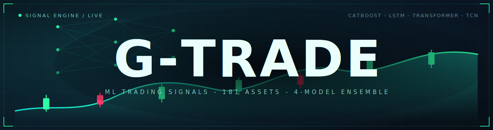

# G-Trade



ML trading signals for ~181 assets: crypto, US, European and Russian stocks, indices, forex, commodities. Each asset has an ensemble of 4 models (CatBoost, LSTM, Transformer, TCN). The best one is picked by walk-forward backtest with commissions. Position sizing is Kelly-based, with drawdown stops.

## How it works

1. `data_engine.py` downloads up to 15 years of daily and weekly quotes from Yahoo Finance and MOEX into `market.db` (SQLite).
2. `train_hybrid.py` builds features: returns and volatility-normalized returns, volatility, tail risk (Taleb kurtosis, skew, VaR), RSI, MACD, SMA, ATR, weekly and cross-asset correlations, cross-asset lead-lag, calendar position, and macro regime (10y yield, VIX, dollar). Trains the ensemble and saves the champion together with its scaler and probability calibrator.
3. `predict.py` prints BUY/SELL/WAIT with confidence for all assets.
4. `backtest.py` checks champions on held-out data: PnL, win rate, Sharpe, directional accuracy, Brier, alpha vs buy & hold.
5. `risk_manager.py` and `portfolio.py` do position sizing, loss limits and correlations. Tail risk is gated by the Taleb index: position size shrinks above the soft cap and new buys are blocked above the hard cap.

On top of the signals there are supporting layers: a Guru Council (Lynch, Buffett, Graham, Munger) from `guru_report.py` as a long-term value overlay, shown only for assets with real fundamentals and tracked at a 60-day horizon while the ML signal stays primary; news sentiment from `news_analyzer.py`; and a market regime / fear-greed read. `db_check.py` is a read-only audit of `market.db` (freshness, OHLC sanity, gaps, coverage).

`app.py` is a Streamlit dashboard. The Telegram bot sends signals every hour.

## Web UI

```
uvicorn webapp:app --host 0.0.0.0 --port 8000
```

Lightweight web interface, no TensorFlow needed, reads predictions from the database, starts instantly. Pages:

- `/` signal radar: BUY/SELL/WAIT per asset with confidence, live accuracy, a Taleb tail-risk column, a live market-breadth panel and regime / fear-greed gauges
- `/asset/BTC` per-asset detail: price and candle charts, signal history, model consensus, Taleb tail risk, and the Guru Council value verdict (N/A for non-stocks) with on-demand recalculate
- `/portfolio` portfolio analytics over your open positions: diversification score, sector exposure heat, held-asset correlation and per-position warnings
- `/whatif` what-if simulator: backtest "what if I had invested $X, N days ago, following the signals", with an equity curve and per-asset breakdown
- `/loop` self-maintaining loop: daily cycle status and drift proposals, with one-click approve of a champion-challenger retrain
- `/guru` value overlay: the council verdict next to the ML signal for each stock, with a 60-day accuracy track record
- `/risk` interactive risk manager: open and close positions, edit and persist risk limits, manually halt or resume trading, plus a Taleb tail-risk watchlist of the highest-risk assets
- `/market`, `/sectors`, `/correlations`, `/performance`, `/news`, `/models` analytics pages

Same data as JSON under `/api/...`. Pages auto-refresh; the regime and fear-greed gauges update live with a pulsing needle; a Cmd-K command palette jumps to any asset or page; a ticker tape of top movers runs along the bottom. Works from a phone on the same network.

## Telegram bot

`python alert_bot.py` runs the hourly scan and also:

- commands /top, /signal BTC, /risk, /digest (owner only)
- morning digest, hour is set by GTRADE_DIGEST_HOUR, default 9
- degradation warnings: data older than 7 days or accuracy below 40% on the last 20 verified signals

## Self-maintaining loop

`loop_cycle.py` runs the safe daily pipeline (data, predict, reconcile) and scans every asset for drift: rolling accuracy below a floor, a drop from the trained baseline, model age, or stale data. Proposals show up on the `/loop` page. Approving one runs `loop_retrain.py`, a RAM-safe champion-challenger retrain (force-promote off) that replaces a champion only if the fresh model beats it. The loop never retrains on its own; retraining always waits for your approval.

Register `run_loop.bat` with Windows Task Scheduler to run the cycle daily:

```
schtasks /Create /TN "G-Trade Loop" /TR "\"%CD%\run_loop.bat\"" /SC DAILY /ST 23:30
```

Drift thresholds live in `core/drift.py` (`DRIFT_CONFIG`). The cycle writes `loop_state.json`; a lockfile keeps the cycle and a retrain from running at the same time.

## Auto-research agent

The feature set can be extended at train time through a constrained transform DSL in `core/feature_dsl.py` (z-score, ratio, lag, diff, rolling, interaction, cross-asset lead-lag over the existing columns, no eval). Point `GTRADE_DSL_SPECS` at a JSON file of specs and list their names in `GTRADE_EXTRA_FEATURES`, and training materializes them as extra candidates; with both unset training is unchanged.

`auto_research.py` (a local tool, run via `auto_research.bat`) automates the search as a forward selection: each round a proposer suggests a spec, a cheap univariate pre-screen drops proposals with no signal, the baseline (trained once and cached) is compared against base plus the kept features plus the new one, and a feature is kept only if it improves the cumulative result. State is persisted, so a run resumes where it stopped. The default proposer is an evolutionary search with no LLM and no API key; `GTRADE_AR_PROPOSER=llm` uses a model instead (Anthropic by default, or `GTRADE_AR_LLM=openai` for OpenAI and any OpenAI-compatible endpoint such as Mistral or a local Ollama via `GTRADE_AR_LLM_BASE_URL`).

It never touches production: variants train into isolated directories, and a winner is flagged only after also clearing a separate held-out set by a sign-test (with an effect-size floor and an iteration budget) that guards against overfitting to noise. Adopting a flagged feature stays a manual full retrain.

The launcher `auto_research.bat` is an interactive menu (mode, proposer, budget, objective; Enter = default). The agent keeps permanent cross-run memory: `_ar_tried.json` (no candidate is ever re-tested), `_ar_eval_cache.json` (base trainings are reused until new data arrives) and `_ar_findings.json` (the cumulative findings journal), so the budget buys NEW experiments on every run. The LLM proposer supports a local Ollama model (`GTRADE_AR_LLM=ollama`, gemma auto-detected) in both the features axis and the QD agent (probability `GTRADE_AR_QD_LLM_P` per child, silent fallback to evolutionary search).

Advanced knobs (`GTRADE_AR_SEED`, `AR_PRESCREEN_MIN`, the screen, the QD sizes, the LLM model/URL) stay as `set` lines at the top of `auto_research.bat`, or run headless:

```
GTRADE_AR_SEED=42 AR_BUDGET=5 python auto_research.py
```

## Quick start

```bash
pip install -r requirements.txt
cp .env.example .env          # telegram token, proxy if needed

python data_engine.py         # download market data
python train_hybrid.py        # train models
python predict.py             # console signals
streamlit run app.py          # dashboard
```

`python launcher.py` opens a text menu over all of the above (full cycle, dashboard, web UI, predict, DB audit, and more). `python db_check.py` runs a read-only audit of `market.db`; add `--fix` to repair duplicates and date formats.

`python scheduler.py` runs as a daemon: data every 6h, predictions every 4h, daily DB check.

## Network

If SOCKS5_PROXY is set in `.env`, outbound requests go through it. `net.py` checks if the proxy is alive and falls back to a direct connection.

- GTRADE_PROXY_MODE=auto|on|off, default auto
- GTRADE_SSL_VERIFY=0 disables TLS certificate checks. Verification is on by default, turn it off only if your proxy intercepts TLS

## Training

TensorFlow on Windows is CPU-only since 2.11, so neural training runs on CPU. Good enough for daily data. For a GPU use WSL2 and `pip install tensorflow[and-cuda]`.

TensorFlow accumulates memory across many assets in one process, so a full 181-asset retrain on a memory-constrained box is best run in chunks (about 15 assets via `GTRADE_ASSETS`), restarting a fresh process per chunk; each restart releases the memory and keeps RAM flat. The champion registry accumulates per asset, so chunks add up to a full run.

Optional env flags for `train_hybrid.py`:

- `GTRADE_ADAPTIVE_NETS=1` - size each net to the asset's data (fewer params, faster, less overfit); off by default keeps the original flat nets
- `GTRADE_NET_CAP` - cap for the adaptive LSTM units (default 128); lower it, e.g. 80, to shrink the data-rich assets, the main speed and RAM lever
- `GTRADE_EPOCHS_LSTM`, `GTRADE_EPOCHS_TF`, `GTRADE_EPOCHS_TCN` - per-net epoch caps (defaults 160, 100, 80); early stopping usually trims them further
- `GTRADE_FEATURE_SET=base|ext` - which candidate feature set to train on; `ext` (default, the adopted set) drops the raw non-stationary close/volume and adds macro, volatility-normalized returns, cross-asset lead-lag and calendar; `base` is the older list, kept for an A/B
- `GTRADE_FORCE_PROMOTE=1` - accept new champions regardless of score (use after a feature-set change); leave it off for a champion-challenger retrain that keeps the old model unless beaten
- `GTRADE_ASSETS=BTC,ETH,NVDA` - train only the listed assets (subset or chunk)
- `GTRADE_HISTORY_DAYS` - how far back `data_engine.py` fetches (default 15 years); `GTRADE_BACKFILL=1` re-pulls older bars for tables that already exist
- `GTRADE_WORKERS`, `GTRADE_MAX_FOLDS` - parallel workers and the walk-forward fold cap
- `GTRADE_CB_DEVICE=GPU` - run CatBoost on GPU (Windows-native; benchmark first, often slower on the small per-asset datasets)

## Config

- `.env` - telegram credentials, proxy
- `config.py` - asset list and buy/sell thresholds
- `auto_trader_config.json` - paper trading settings
- `pyproject.toml` - ruff and pytest configuration

## Tests

```bash
pytest -q
ruff check .
```

## License

Creative Commons Attribution-NonCommercial 4.0 (CC BY-NC 4.0). See `LICENSE`.
