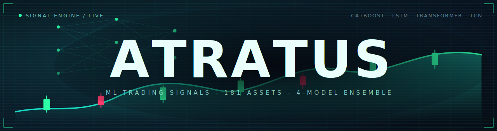
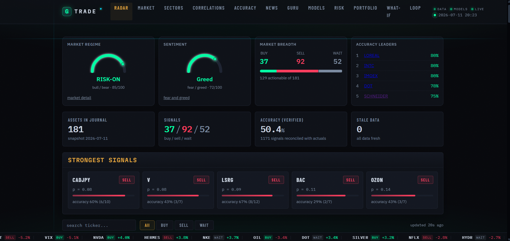
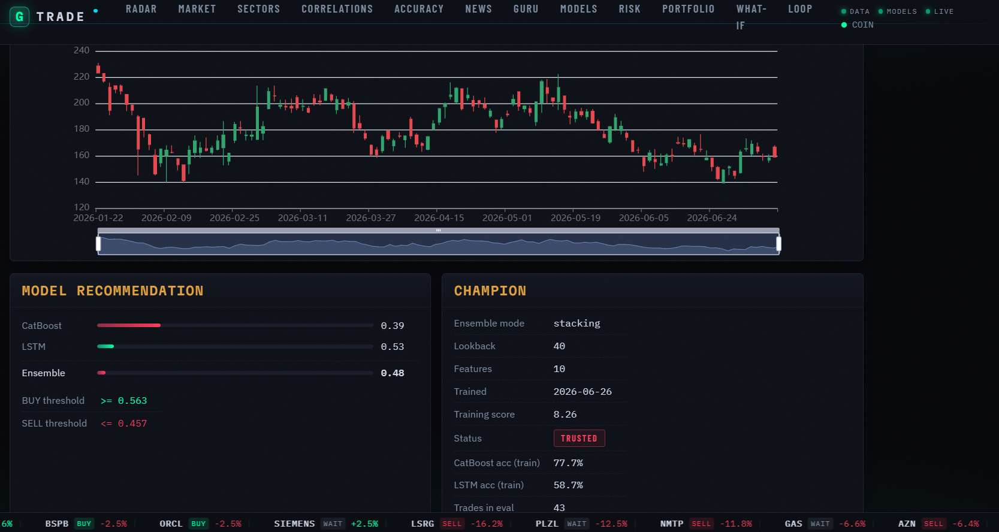
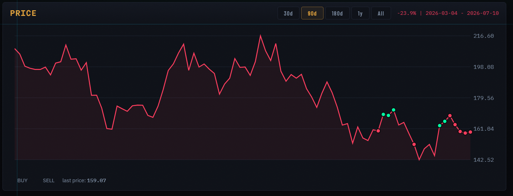

# Atratus



[](https://github.com/pavlenchichikov/Atratus/actions/workflows/ci.yml)
[](https://www.python.org/)
[](https://github.com/astral-sh/ruff)
[](LICENSE)

<details open>
<summary><b>English</b></summary>

<br>

**Multi-asset machine-learning trading-signal engine.** A per-asset ensemble (CatBoost + LSTM + Transformer + TCN) over ~208 markets - crypto, US / European / Russian equities, indices, forex and commodities - with walk-forward selection, calibrated probabilities, Kelly sizing, tail-risk controls, a FastAPI dashboard, and an autonomous, statistically-gated research agent. Signals only, human-in-the-loop - no auto-execution.

> **Disclaimer.** Atratus is a research and educational project. Its output is a set of model predictions - **not financial advice and not a recommendation to buy or sell any security**. Markets carry risk and you can lose money. The software is provided "as is", without warranty of any kind. Use it at your own risk; do your own research and consult a licensed professional before making any financial decision. See [Disclaimer](#disclaimer) in full.

[](https://github.com/pavlenchichikov/Atratus/releases/latest/download/Atratus.apk)

## Table of contents

- [Features](#features)
- [How it works](#how-it-works)
- [Web UI](#web-ui)
- [Screenshots](#screenshots)
- [Auto-research agent](#auto-research-agent)
- [Self-maintaining loop](#self-maintaining-loop)
- [Live-accuracy gate and recalibration](#live-accuracy-gate-and-live-recalibration)
- [Telegram bot](#telegram-bot)
- [Publishing signals to the landing site](#publishing-signals-to-the-landing-site)
- [Mobile app](#mobile-app)
- [Tech stack](#tech-stack)
- [Requirements](#requirements)
- [Quick start](#quick-start)
- [Training](#training)
- [Network](#network)
- [Configuration](#configuration)
- [Project layout](#project-layout)
- [Tests](#tests)
- [License](#license)
- [Disclaimer](#disclaimer)

## Features

- **~208 assets, one model each.** Every asset trains its own ensemble of four models (CatBoost, LSTM, Transformer, TCN); the champion is chosen by a walk-forward backtest with commissions, slippage and an embargo against leakage.
- **Honest, calibrated signals.** BUY / SELL / WAIT with a calibrated probability, per-asset tuned thresholds, and a live accuracy track record that reconciles each prediction against the realized next-bar move.
- **Risk-managed by design.** Kelly-based position sizing, drawdown stops, sector-exposure and correlation checks, and a Taleb tail-risk index that shrinks size above a soft cap and blocks new buys above a hard cap.
- **Rich feature set.** Returns and volatility-normalized returns, tail risk (kurtosis / skew / VaR), RSI / MACD / SMA / ATR, weekly and cross-asset correlations, cross-asset lead-lag, calendar position, and a macro regime read (10y yield, VIX, dollar).
- **Autonomous research agent.** A quality-diversity (MAP-Elites) search over features, labels and transforms, with a rigorous held-out adoption gate (Wilcoxon signed-rank + Benjamini-Hochberg + cross-run replication) so nothing is adopted on noise. Never touches production automatically.
- **Instant FastAPI dashboard.** Reads ready-made predictions from the database (no TensorFlow at serve time), so it starts immediately - signal radar, per-asset detail, portfolio analytics, an interactive risk manager, and a what-if backtester.
- **Value overlay.** A "Guru Council" (Lynch, Buffett, Graham, Munger) as a long-term fundamentals overlay for real stocks, tracked at a 60-day horizon while the ML signal stays primary.

## How it works

1. `data_engine.py` downloads up to 15 years of daily and weekly quotes from Yahoo Finance and MOEX into `market.db` (SQLite).
2. `train_hybrid.py` builds the features (above), trains the ensemble, and saves the champion together with its scaler and probability calibrator, chosen by walk-forward backtest.
3. `predict.py` prints BUY / SELL / WAIT with confidence for all assets.
4. `backtest.py` checks champions on held-out data: PnL, win rate, Sharpe, directional accuracy, Brier, alpha vs buy & hold.
5. `risk_manager.py` and `portfolio.py` do position sizing, loss limits and correlation checks. Tail risk is gated by the Taleb index: size shrinks above the soft cap, new buys are blocked above the hard cap.

Supporting layers: a **Guru Council** value overlay (`guru_report.py`, shown only for assets with real fundamentals), news sentiment (`news_analyzer.py`), a market regime / fear-greed read, and `db_check.py`, a read-only audit of `market.db` (freshness, OHLC sanity, gaps, coverage).

`app.py` is a Streamlit dashboard; the Telegram bot sends signals every hour.

## Web UI

```bash
uvicorn webapp:app --host 0.0.0.0 --port 8000
```

Lightweight web interface - no TensorFlow needed, reads predictions from the database, starts instantly. Pages:

- `/` - signal radar: BUY / SELL / WAIT per asset with confidence, live accuracy, a Taleb tail-risk column, a live market-breadth panel and regime / fear-greed gauges
- `/asset/BTC` - per-asset detail: price and candle charts, signal history, model consensus, Taleb tail risk, and the Guru Council value verdict (N/A for non-stocks) with on-demand recalculate
- `/portfolio` - portfolio analytics over open positions: diversification score, sector-exposure heat, held-asset correlation, per-position warnings
- `/whatif` - what-if simulator: "what if I had invested $X, N days ago, following the signals", with an equity curve and per-asset breakdown
- `/risk` - interactive risk manager: open / close positions, edit and persist risk limits, halt / resume trading, plus a Taleb tail-risk watchlist
- `/loop` - self-maintaining loop: daily cycle status and drift proposals, with one-click approve of a champion-challenger retrain
- `/guru` - value overlay: the council verdict next to the ML signal, with a 60-day accuracy track record and a one-click **Recalculate all** that re-scores every stock in the background
- `/market`, `/sectors`, `/correlations`, `/performance`, `/news`, `/models` - analytics pages

Same data as JSON under `/api/...`. Pages auto-refresh; a Cmd-K palette jumps to any asset or page; a ticker tape of top movers runs along the bottom. Works from a phone on the same network.

## Screenshots

**Signal radar** - the home dashboard: market regime and sentiment gauges, breadth, accuracy leaders, and the strongest live signals with their track record.



**Per-asset detail** - candlestick chart with the model recommendation (per-model probabilities, tuned BUY / SELL thresholds) and the champion card (ensemble mode, training score, trust status).



**Signals on the price** - historical BUY / SELL calls plotted on the price line, with a selectable time range.



**Console output** - `predict.py` prints BUY / SELL / WAIT for every asset with the calibrated probability, the ensemble mode and the Taleb tail-risk read.

```text
$ python predict.py
  REAL-TIME RADAR  |  2026-07-12 02:31

  BTC      BUY    p=0.62  STACK  taleb=0.3
  ETH      WAIT   p=0.51  STACK
  NVDA     BUY    p=0.66  STACK  taleb=0.4
  SBER     SELL   p=0.38  STACK  taleb=1.2
  EURUSD   WAIT   p=0.49  STACK
  GOLD     BUY    p=0.58  STACK  taleb=0.2
```

## Auto-research agent

The feature set can be extended at train time through a constrained transform DSL in `core/feature_dsl.py` (z-score, ratio, lag, diff, rolling, interaction, cross-asset lead-lag over existing columns - no `eval`). Point `GTRADE_DSL_SPECS` at a JSON file of specs and list their names in `GTRADE_EXTRA_FEATURES`; with both unset, training is unchanged.

`auto_research.py` (a local tool, run via `auto_research.bat`) automates the search - a quality-diversity (MAP-Elites) illumination over feature, label and transform genomes, or a simpler forward selection. A proposer suggests a candidate, a cheap CatBoost-only pre-screen drops the obvious losers, and the cached baseline is compared against the candidate. The default proposer is an evolutionary search with no LLM and no API key; `GTRADE_AR_PROPOSER=llm` uses a model instead (Anthropic by default, OpenAI or any OpenAI-compatible endpoint such as Mistral or a **local Ollama** via `GTRADE_AR_LLM=ollama`).

The genome also carries **relative model-hyperparameter genes** (a depth delta, learning-rate and iteration multipliers, a lookback delta - applied on top of each asset's tuned baseline, never as one absolute number for all assets), **net-hygiene genes** (seed-averaging, per-net calibration, uniqueness weighting) and the **triple-barrier label** (its window doubling as the horizon). The same levers are searchable one-at-a-time via the `hyper`, `nets`, `thresholds`, `regime` and extended `labeling` axes in the launcher menu.

Selection-time TUNING is searchable too: a threshold margin and neutral-band delta applied over each asset's own tuned thresholds, and the regime-filter mode (both / off / SMA-only / Taleb-only). The QD archive niches now also key on WHICH lever group a genome touches, so one lever class cannot monopolize the map, and a cheap mid tier (4 assets at half epochs, `GTRADE_AR_TIER=0` to disable) drops clearly-negative candidates before they earn a full training run.

Re-gating stored candidates (`--regate`) is **crash-safe**: every finished candidate checkpoints to `_regate_progress.json` and its trains are cached by genome signature, so an interrupted multi-day run resumes where it stopped (as long as the market data has not refreshed in between) instead of restarting from zero.

**It never touches production.** Candidates train into isolated temp directories, and a winner is flagged only after clearing a separate held-out set under a one-sided **Wilcoxon signed-rank** test (with a practical effect-size floor, a **Benjamini-Hochberg** correction across candidates, an iteration budget, and a **cross-run replication** gate) - designed to reject improvements that are only noise. Adopting a flagged winner stays a manual full retrain.

Permanent cross-run memory: `_ar_tried.json` (no candidate is re-tested), `_ar_eval_cache.json` (base trainings reused until new data arrives) and `_ar_findings.json` (the cumulative findings journal), so the budget buys **new** experiments every run.

**Research wiki (optional, `GTRADE_AR_WIKI=1`).** Distills the append-only findings journal into a compounding, self-maintained knowledge base (Karpathy's "LLM Wiki" pattern): after each run an LLM folds new findings into a few interlinked markdown topic pages under `_ar_wiki/`, tagging claims by confidence and reconciling contradictions, and the proposer reads that distilled wiki instead of only the last few findings. The pages also render read-only on `/research`. Off by default (byte-identical).

**Chronos forecast features (optional, experimental).** Zero-shot forecasts from a pretrained time-series model as extra CatBoost features. Install `requirements-chronos.txt`, precompute the cache (`python precompute_chronos.py --assets all`), then A/B via `GTRADE_CHRONOS=1 GTRADE_EXTRA_FEATURES=chronos_dir,chronos_ret,chronos_spread`. They enter only through `GTRADE_EXTRA_FEATURES`, so the production model is unchanged until adopted.

## Self-maintaining loop

`loop_cycle.py` runs the safe daily pipeline (data, predict, reconcile) and scans every asset for drift - rolling accuracy below a floor, a drop from the trained baseline, model age, or stale data. Proposals surface on `/loop`. Approving one runs `loop_retrain.py`, a RAM-safe champion-challenger retrain that replaces a champion only if the fresh model beats it. **The loop never retrains on its own; retraining always waits for your approval.** Register `run_loop.bat` with Task Scheduler to run daily. Drift thresholds live in `core/drift.py` (`DRIFT_CONFIG`).

## Live-accuracy gate and live recalibration

Signals whose SEGMENT is provably bad in the live track record are suppressed
to WAIT before display (`core/live_gate.py`): an asset class below 45%
verified accuracy (n >= 100), an asset below 40% (n >= 20), or an
anti-calibrated extreme probability (>= 0.85 / <= 0.15). The tracker keeps
logging the RAW signal, so a gated segment rehabilitates itself when fresh
statistics improve; the radar and the web UI show a "gated" badge with the
reason. `GTRADE_LIVE_GATE=0` disables the gate; the thresholds live in
`GTRADE_LIVE_GATE_*` env knobs.

`python recalibrate_live.py` (weekly) fits a global isotonic layer mapping
raw serve probabilities to the live P(up) from verified outcomes
(`models/live_calib_global.pkl`; delete the file to roll back).

The accuracy shown per asset is scoped to the current model generation, but
falls back to the lifetime record across all generations when the active model
has too few verified signals yet - so a retrain never blanks the panel for an
asset with real history.

## Telegram bot

`python alert_bot.py` runs the hourly scan over the full asset universe, scoring each asset through the same shared pipeline as `predict.py` (`core/scoring.py`), so its Telegram calls match the dashboard. It also serves `/top`, `/signal BTC`, `/risk`, `/digest` (owner only), a morning digest (`GTRADE_DIGEST_HOUR`, default 9), and degradation warnings (data older than 7 days, or accuracy below 40% on the last 20 verified signals).

## Publishing signals to the landing site

`push_signals.py` exports the latest signal snapshot to a Supabase project that
backs the public landing site. It reads the per-asset latest signal and accuracy
from the local journal (no models are loaded), then upserts a full `signals`
table (gated behind a per-user allow-list by row-level security) and an
anonymized `public_stats` row (the public teaser: BUY / SELL / WAIT counts,
accuracy, breadth, and the snapshot date).

The same run also feeds the mobile app: it exports per-asset OHLC history
(`bars`), the recent signal track record (`signal_history`) and Guru Council
verdicts (`guru`, `guru_stats`) - all gated by the same allow-list - and, when
`GTRADE_FCM_CREDS` points to a Firebase service-account JSON, sends a personal
push notification with the day's top signals to registered devices of
allow-listed users.

Set `SUPABASE_URL` and `SUPABASE_SERVICE_KEY` in `.env` (the service key is
secret and must never be committed or shipped to the browser), then run it after
`predict.py`:

```bash
python push_signals.py          # or option [SG] in run_gtrade.bat
```

Run it by hand daily, or schedule it (Task Scheduler) once you are happy with it.

## Mobile app

A companion **Flutter** app (Android) is a thin client of the same Supabase
snapshot: no models and no market data ship in the app, it only reads the gated
feed `push_signals.py` publishes. Magic-link sign-in plus the same per-user
allow-list (row-level security) gate every screen. It offers a signal radar,
per-asset detail with charts, the Guru value overlay, a market-sector
breakdown, an accuracy leaderboard, a recent-verified-calls feed and a
client-side what-if simulator, refreshing on resume and pull-to-refresh.
Optional Firebase Cloud Messaging (`GTRADE_FCM_CREDS`) delivers the day's top
signals as a push notification. The Supabase schema for these tables lives in
[`supabase/mobile_app.sql`](supabase/mobile_app.sql).

## Tech stack

- **Language:** Python 3.12
- **ML:** CatBoost, TensorFlow / Keras (LSTM, Transformer, TCN), scikit-learn, Optuna, scipy; optional Amazon Chronos (zero-shot forecasts)
- **Serving / UI:** FastAPI + Uvicorn (web UI), Streamlit (`app.py`), Jinja2
- **Mobile:** Flutter (Android) thin client over Supabase; Firebase Cloud Messaging
- **Data:** SQLite (`market.db`), pandas / numpy, Yahoo Finance + MOEX
- **Research agent:** MAP-Elites quality-diversity search; pluggable LLM proposer (Anthropic / OpenAI / local Ollama)
- **Ops / tooling:** Ruff, pytest, GitHub Actions CI, Telegram Bot API

## Requirements

- **Python 3.12** (3.11+ likely works; 3.12 is what CI runs).
- **OS:** Linux, macOS or Windows. On Windows, TensorFlow is CPU-only since 2.11 - fine for daily-bar training; for GPU use WSL2.
- **Disk:** ~5 GB free - trained models (~4 GB for all 208 assets) plus `market.db` (~70 MB). Serving alone needs far less.
- **RAM:** 8 GB is enough to run the dashboard and `predict.py` (no TensorFlow at serve time). Training the full universe wants ~16 GB, or train in chunks of ~15 assets (`GTRADE_ASSETS`) on a smaller box.
- **GPU:** optional. Neural nets train on CPU by default; CatBoost can use a GPU (`GTRADE_CB_DEVICE=GPU`) but is often slower on the small per-asset datasets.
- **Network:** outbound access to Yahoo Finance and MOEX for data (`SOCKS5_PROXY` supported).

## Quick start

```bash
pip install -r requirements.txt
cp .env.example .env          # telegram token, proxy if needed

python data_engine.py         # download market data
python train_hybrid.py        # train models
python predict.py             # console signals
streamlit run app.py          # dashboard
```

`run_gtrade.bat` opens a text menu over all of the above (full cycle, dashboard, web UI, predict, DB audit, and more). `python db_check.py` runs a read-only audit of `market.db` (`--fix` repairs duplicates and date formats). `python scheduler.py` runs as a daemon: data every 6h, predictions every 4h, a daily DB check.

## Training

TensorFlow on Windows is CPU-only since 2.11, so neural training runs on CPU - fine for daily data. For a GPU, use WSL2 and `pip install tensorflow[and-cuda]`.

TensorFlow accumulates memory across many assets in one process, so a full 208-asset retrain on a memory-constrained box is best run in chunks (~15 assets via `GTRADE_ASSETS`), restarting a fresh process per chunk; the champion registry accumulates per asset, so chunks add up to a full run.

Optional env flags for `train_hybrid.py`:

- `GTRADE_ADAPTIVE_NETS=1` - size each net to the asset's data (fewer params, faster, less overfit); off by default keeps the original flat nets
- `GTRADE_NET_CAP` - cap for the adaptive LSTM units (default 128); the main speed / RAM lever
- `GTRADE_EPOCHS_LSTM`, `GTRADE_EPOCHS_TF`, `GTRADE_EPOCHS_TCN` - per-net epoch caps (defaults 160, 100, 80)
- `GTRADE_FEATURE_SET=base|ext` - which candidate feature set to train on (`ext` is the adopted default)
- `GTRADE_FORCE_PROMOTE=1` - accept new champions regardless of score (use after a feature-set change)
- `GTRADE_ASSETS=BTC,ETH,NVDA` - train only the listed assets (subset or chunk)
- `GTRADE_HISTORY_DAYS`, `GTRADE_BACKFILL=1` - fetch depth and re-pull of older bars
- `GTRADE_WORKERS`, `GTRADE_MAX_FOLDS` - parallel workers and the walk-forward fold cap
- `GTRADE_CB_DEVICE=GPU` - run CatBoost on GPU (benchmark first; often slower on the small per-asset datasets)

The walk-forward selection objective has an env-gated v2
(`GTRADE_OBJECTIVE_V2=1`): costs are charged on position CHANGES instead of
every signal bar (matching how the asset pages display positions), Sharpe and
drawdown come from the daily equity curve, and the fixed 4% per-bar clip
becomes a per-asset vol-scaled cap. `python ab_objective.py` trains a subset
under both objectives into isolated dirs and compares the champions on the
shared `Score_v2` yardstick; the default stays v1 until that A/B and a full
retrain say otherwise.

## Network

If `SOCKS5_PROXY` is set in `.env`, outbound requests go through it; `net.py` checks the proxy is alive and falls back to a direct connection.

- `GTRADE_PROXY_MODE=auto|on|off` (default auto)
- `GTRADE_SSL_VERIFY=0` disables TLS certificate checks (on by default; turn off only if your proxy intercepts TLS)

## Configuration

- `.env` - telegram credentials, proxy (never committed; see `.env.example`)
- `config.py` - asset list and buy/sell thresholds
- `auto_trader_config.json` - paper-trading settings
- `pyproject.toml` - Ruff and pytest configuration

## Project layout

```text
data_engine.py        fetch daily/weekly quotes (Yahoo + MOEX) into market.db
train_hybrid.py       train the per-asset ensemble + walk-forward selection
train_chunked.py      RAM-safe full retrain (fresh process per chunk)
predict.py            console signal radar
backtest.py           held-out evaluation (PnL, Sharpe, Brier, alpha)
webapp.py             FastAPI dashboard (app.py = Streamlit)
alert_bot.py          Telegram bot (hourly scan)
risk_manager.py       Kelly sizing, loss/drawdown limits, Taleb gate
guru_report.py        Guru Council fundamentals overlay
auto_research.py      autonomous research agent (run via auto_research.bat)
push_signals.py       publish the snapshot to Supabase (web + mobile)
scheduler.py          daemon: data / predict / DB-check on a schedule
run_gtrade.bat        Windows text menu over the whole pipeline
core/                 shared library: features, ensemble, scoring, calibration,
                      backtesting, risk, live_gate, guru, dashboard, ...
tests/                pytest suite (600+ tests)
supabase/             SQL schema for the mobile/web Supabase backend
```

## Tests

```bash
pytest -q
ruff check .
```

## License

PolyForm Noncommercial License 1.0.0. Free to use, modify and share for any noncommercial purpose (personal, research, education, nonprofits); commercial use requires a separate license from the owner. See [`LICENSE`](LICENSE).

## Disclaimer

Atratus is provided for **research and educational purposes only**. It is not investment advice, financial advice, or a recommendation, solicitation or offer to buy or sell any security or financial instrument. Trading and investing involve substantial risk of loss and are not suitable for every investor; past or simulated performance does not guarantee future results. The authors and contributors accept no liability for any loss or damage arising from the use of this software, which is provided "AS IS", without warranty of any kind. You are solely responsible for your own decisions - do your own research and consult a licensed financial professional before acting on anything produced by this project.

</details>

<details>
<summary><b>Русский</b></summary>

<br>

**Мультиактивный движок торговых сигналов на машинном обучении.** Пер-активный ансамбль (CatBoost + LSTM + Transformer + TCN) по ~208 рынкам — крипта, акции США / Европы / России, индексы, форекс и товары — с walk-forward-отбором чемпионов, калиброванными вероятностями, размером позиции по Келли, контролем хвостового риска, дашбордом на FastAPI и автономным, статистически-гейтованным исследовательским агентом. Только сигналы, человек в контуре — без автоисполнения.

> **Дисклеймер.** Atratus — исследовательский и учебный проект. Его вывод — набор модельных предсказаний, **а не финансовый совет и не рекомендация покупать или продавать какую-либо ценную бумагу**. Рынки несут риск, вы можете потерять деньги. ПО предоставляется «как есть», без каких-либо гарантий. Используйте на свой риск; проводите собственный анализ и консультируйтесь с лицензированным специалистом перед любым финансовым решением. Полный текст — в разделе [Дисклеймер](#дисклеймер). Юридически приоритетна английская версия и файл [`LICENSE`](LICENSE).

[](https://github.com/pavlenchichikov/Atratus/releases/latest/download/Atratus.apk)

## Оглавление

- [Возможности](#возможности)
- [Как это работает](#как-это-работает)
- [Веб-интерфейс](#веб-интерфейс)
- [Скриншоты](#скриншоты)
- [Исследовательский агент](#исследовательский-агент)
- [Самоподдерживающийся цикл](#самоподдерживающийся-цикл)
- [Гейт по живой точности и рекалибровка](#гейт-по-живой-точности-и-рекалибровка)
- [Telegram-бот](#telegram-бот)
- [Публикация сигналов на лендинг](#публикация-сигналов-на-лендинг)
- [Мобильное приложение](#мобильное-приложение)
- [Технологии](#технологии)
- [Требования](#требования)
- [Быстрый старт](#быстрый-старт)
- [Обучение](#обучение)
- [Сеть](#сеть)
- [Конфигурация](#конфигурация)
- [Структура проекта](#структура-проекта)
- [Тесты](#тесты)
- [Лицензия](#лицензия)
- [Дисклеймер](#дисклеймер)

## Возможности

- **~208 активов, у каждого своя модель.** Для каждого актива обучается собственный ансамбль из четырёх моделей (CatBoost, LSTM, Transformer, TCN); чемпион выбирается walk-forward-бэктестом с комиссиями, проскальзыванием и эмбарго против утечки.
- **Честные, калиброванные сигналы.** BUY / SELL / WAIT с калиброванной вероятностью, пер-активными настроенными порогами и живым трек-рекордом точности, который сверяет каждое предсказание с реализованным движением следующего бара.
- **Управление риском по замыслу.** Размер позиции по Келли, стопы по просадке, проверки секторной экспозиции и корреляций, а также индекс хвостового риска Талеба, который уменьшает размер выше мягкого порога и блокирует новые покупки выше жёсткого.
- **Богатый набор признаков.** Доходности и волатильностно-нормированные доходности, хвостовой риск (эксцесс / асимметрия / VaR), RSI / MACD / SMA / ATR, недельные и межактивные корреляции, межактивный lead-lag, календарная позиция и макро-режим (доходность 10-леток, VIX, доллар).
- **Автономный исследовательский агент.** Поиск quality-diversity (MAP-Elites) по признакам, лейблам и трансформациям со строгим гейтом адопции на отложенной выборке (Wilcoxon signed-rank + Benjamini-Hochberg + межзапусковая репликация), чтобы ничего не адоптилось на шуме. Никогда не трогает прод автоматически.
- **Мгновенный дашборд на FastAPI.** Читает готовые предсказания из БД (без TensorFlow во время обслуживания), поэтому стартует сразу — радар сигналов, детализация по активу, аналитика портфеля, интерактивный риск-менеджер и what-if-бэктестер.
- **Value-оверлей.** «Совет гуру» (Линч, Баффет, Грэм, Мангер) как долгосрочный фундаментальный оверлей для реальных акций, с горизонтом точности 60 дней; ML-сигнал остаётся основным.

## Как это работает

1. `data_engine.py` скачивает до 15 лет дневных и недельных котировок с Yahoo Finance и MOEX в `market.db` (SQLite).
2. `train_hybrid.py` строит признаки (см. выше), обучает ансамбль и сохраняет чемпиона вместе со скейлером и калибратором вероятностей, выбранного walk-forward-бэктестом.
3. `predict.py` печатает BUY / SELL / WAIT с уверенностью по всем активам.
4. `backtest.py` проверяет чемпионов на отложенных данных: PnL, win rate, Sharpe, направленная точность, Brier, альфа против buy & hold.
5. `risk_manager.py` и `portfolio.py` делают размер позиции, лимиты убытка и проверки корреляций. Хвостовой риск гейтится индексом Талеба: размер сжимается выше мягкого порога, новые покупки блокируются выше жёсткого.

Вспомогательные слои: value-оверлей **«Совет гуру»** (`guru_report.py`, показывается только для активов с реальной фундаменталкой), сентимент новостей (`news_analyzer.py`), чтение рыночного режима / fear-greed и `db_check.py` — read-only аудит `market.db` (свежесть, корректность OHLC, пропуски, покрытие).

`app.py` — дашборд на Streamlit; Telegram-бот шлёт сигналы каждый час.

## Веб-интерфейс

```bash
uvicorn webapp:app --host 0.0.0.0 --port 8000
```

Лёгкий веб-интерфейс — без TensorFlow, читает предсказания из БД, стартует мгновенно. Страницы:

- `/` — радар сигналов: BUY / SELL / WAIT по каждому активу с уверенностью, живой точностью, колонкой хвостового риска Талеба, панелью рыночной ширины в реальном времени и датчиками режима / fear-greed
- `/asset/BTC` — детализация по активу: графики цены и свечей, история сигналов, консенсус моделей, хвостовой риск Талеба и value-вердикт Совета гуру (N/A для не-акций) с пересчётом по требованию
- `/portfolio` — аналитика портфеля по открытым позициям: диверсификация, тепловая карта секторной экспозиции, корреляции удерживаемых активов, пер-позиционные предупреждения
- `/whatif` — what-if-симулятор: «что если бы я вложил $X N дней назад, следуя сигналам», с кривой доходности и разбивкой по активам
- `/risk` — интерактивный риск-менеджер: открыть / закрыть позиции, править и сохранять лимиты риска, останавливать / возобновлять торговлю, плюс watchlist хвостового риска Талеба
- `/loop` — самоподдерживающийся цикл: статус дневного цикла и предложения по дрейфу, с одним кликом на подтверждение переобучения «чемпион-претендент»
- `/guru` — value-оверлей: вердикт совета рядом с ML-сигналом, трек-рекорд точности за 60 дней и кнопка **«Пересчитать всё»** в один клик, которая фоново переоценивает все акции
- `/market`, `/sectors`, `/correlations`, `/performance`, `/news`, `/models` — аналитические страницы

Те же данные в JSON под `/api/...`. Страницы обновляются сами; палитра Cmd-K переходит к любому активу или странице; внизу бежит лента топ-движений. Работает с телефона в той же сети.

## Скриншоты

**Радар сигналов** — домашний дашборд: датчики режима и сентимента, ширина рынка, лидеры точности и самые сильные живые сигналы с их трек-рекордом.


**Детализация по активу** — свечной график с рекомендацией модели (вероятности по каждой модели, настроенные пороги BUY / SELL) и карточкой чемпиона (режим ансамбля, тренировочный score, статус доверия).


**Сигналы на цене** — исторические вызовы BUY / SELL, нанесённые на линию цены, с выбираемым диапазоном времени.


**Консольный вывод** — `predict.py` печатает BUY / SELL / WAIT по каждому активу с калиброванной вероятностью, режимом ансамбля и чтением хвостового риска Талеба.

```text
$ python predict.py
  REAL-TIME RADAR  |  2026-07-12 02:31

  BTC      BUY    p=0.62  STACK  taleb=0.3
  ETH      WAIT   p=0.51  STACK
  NVDA     BUY    p=0.66  STACK  taleb=0.4
  SBER     SELL   p=0.38  STACK  taleb=1.2
  EURUSD   WAIT   p=0.49  STACK
  GOLD     BUY    p=0.58  STACK  taleb=0.2
```

## Исследовательский агент

Набор признаков можно расширять на обучении через ограниченный DSL трансформаций в `core/feature_dsl.py` (z-score, ratio, lag, diff, rolling, interaction, межактивный lead-lag поверх существующих колонок — без `eval`). Укажите `GTRADE_DSL_SPECS` на JSON со спеками и перечислите их имена в `GTRADE_EXTRA_FEATURES`; если обе переменные пусты, обучение не меняется.

`auto_research.py` (локальный инструмент, запускается через `auto_research.bat`) автоматизирует поиск — иллюминацию quality-diversity (MAP-Elites) по геномам признаков, лейблов и трансформаций, либо более простой forward-отбор. Предлагатель подаёт кандидата, дешёвый пре-скрин только по CatBoost отсекает явных аутсайдеров, а закешированный бейслайн сравнивается с кандидатом. Предлагатель по умолчанию — эволюционный поиск без LLM и без API-ключа; `GTRADE_AR_PROPOSER=llm` использует модель (Anthropic по умолчанию, OpenAI или любой OpenAI-совместимый эндпоинт вроде Mistral или **локального Ollama** через `GTRADE_AR_LLM=ollama`).

Геном также несёт **относительные гены гиперпараметров модели** (дельта глубины, множители learning rate и итераций, дельта lookback — применяются поверх настроенного бейслайна каждого актива, а не одним абсолютным числом для всех), **гены нейро-гигиены** (усреднение по сидам, пер-сетевая калибровка, взвешивание уникальности) и **лейбл triple-barrier** (его окно служит горизонтом). Те же рычаги ищутся по одному через оси `hyper`, `nets`, `thresholds`, `regime` и расширенную `labeling` в меню запуска.

Настройки времени отбора тоже ищутся: маржа порогов и дельта нейтральной полосы поверх собственных настроенных порогов каждого актива, и режим режим-фильтра (both / off / только-SMA / только-Талеб). Ниши QD-архива теперь ключуются ещё и по тому, КАКУЮ группу рычагов трогает геном, чтобы один класс рычагов не монополизировал карту, а дешёвый средний тир (4 актива на половине эпох, `GTRADE_AR_TIER=0` отключает) отсеивает явно отрицательных кандидатов до полного трейна.

Ре-гейтинг сохранённых кандидатов (`--regate`) **устойчив к сбоям**: каждый готовый кандидат чекпойнтится в `_regate_progress.json`, а его тренировки кешируются по сигнатуре генома, поэтому прерванный многодневный прогон продолжается с места остановки (пока рыночные данные не обновились), а не начинается заново.

**Он никогда не трогает прод.** Кандидаты обучаются в изолированные временные каталоги, а победитель помечается только после прохождения отдельной отложенной выборки под односторонним тестом **Wilcoxon signed-rank** (с практическим порогом размера эффекта, поправкой **Benjamini-Hochberg** по кандидатам, бюджетом итераций и гейтом **межзапусковой репликации**) — чтобы отсекать улучшения, которые лишь шум. Адопция помеченного победителя остаётся ручным полным ретрейном.

Постоянная межзапусковая память: `_ar_tried.json` (кандидат не тестируется повторно), `_ar_eval_cache.json` (базовые тренировки переиспользуются до прихода новых данных) и `_ar_findings.json` (накопительный журнал находок), так что бюджет покупает **новые** эксперименты каждый запуск.

**Research wiki (опционально, `GTRADE_AR_WIKI=1`).** Дистиллирует append-only журнал находок в накопительную самоподдерживающуюся базу знаний (паттерн «LLM Wiki» Карпаты): после каждого прогона LLM сворачивает новые находки в несколько связанных markdown-страниц под `_ar_wiki/`, помечая утверждения по уверенности и разрешая противоречия, и предлагатель читает эту дистилляцию вместо только последних находок. Страницы также рендерятся read-only на `/research`. По умолчанию выключено (байт-в-байт).

**Признаки-прогнозы Chronos (опционально, экспериментально).** Zero-shot прогнозы предобученной time-series модели как дополнительные признаки CatBoost. Установите `requirements-chronos.txt`, предпосчитайте кеш (`python precompute_chronos.py --assets all`), затем A/B через `GTRADE_CHRONOS=1 GTRADE_EXTRA_FEATURES=chronos_dir,chronos_ret,chronos_spread`. Они входят только через `GTRADE_EXTRA_FEATURES`, поэтому продовая модель не меняется до адопции.

## Самоподдерживающийся цикл

`loop_cycle.py` гоняет безопасный дневной пайплайн (данные, предсказание, сверка) и сканирует каждый актив на дрейф — скользящая точность ниже порога, падение от тренировочного бейслайна, возраст модели или устаревшие данные. Предложения появляются на `/loop`. Подтверждение запускает `loop_retrain.py` — RAM-безопасный ретрейн «чемпион-претендент», который заменяет чемпиона только если свежая модель его превзошла. **Цикл никогда не переобучает сам; переобучение всегда ждёт вашего подтверждения.** Зарегистрируйте `run_loop.bat` в планировщике задач для ежедневного запуска. Пороги дрейфа — в `core/drift.py` (`DRIFT_CONFIG`).

## Гейт по живой точности и рекалибровка

Сигналы, чей СЕГМЕНТ доказуемо плох в живом трек-рекорде, подавляются в WAIT до показа (`core/live_gate.py`): класс актива ниже 45% проверенной точности (n >= 100), актив ниже 40% (n >= 20) или анти-калиброванная экстремальная вероятность (>= 0.85 / <= 0.15). Трекер продолжает логировать СЫРОЙ сигнал, поэтому гейтнутый сегмент реабилитируется при улучшении свежей статистики; радар и веб-интерфейс показывают бейдж «gated» с причиной. `GTRADE_LIVE_GATE=0` отключает гейт; пороги — в env-ключах `GTRADE_LIVE_GATE_*`.

`python recalibrate_live.py` (еженедельно) обучает глобальный изотонический слой, отображающий сырые серв-вероятности в живой P(up) по проверенным исходам (`models/live_calib_global.pkl`; удалите файл для отката).

Точность, показываемая по активу, скоупится к текущему поколению модели, но откатывается на накопленную запись по всем поколениям, когда у активной модели ещё слишком мало проверенных сигналов, — поэтому ретрейн никогда не обнуляет панель для актива с реальной историей.

## Telegram-бот

`python alert_bot.py` гоняет ежечасный скан по всей вселенной активов, оценивая каждый актив через тот же общий пайплайн, что и `predict.py` (`core/scoring.py`), так что его вызовы в Telegram совпадают с дашбордом. Он также обслуживает `/top`, `/signal BTC`, `/risk`, `/digest` (только владелец), утренний дайджест (`GTRADE_DIGEST_HOUR`, по умолчанию 9) и предупреждения о деградации (данные старше 7 дней или точность ниже 40% на последних 20 проверенных сигналах).

## Публикация сигналов на лендинг

`push_signals.py` экспортирует свежий снимок сигналов в проект Supabase, который питает публичный лендинг. Он читает пер-активный последний сигнал и точность из локального журнала (модели не грузятся), затем upsert-ит полную таблицу `signals` (гейтнутую пер-пользовательским allow-list через row-level security) и анонимизированную строку `public_stats` (публичный тизер: счётчики BUY / SELL / WAIT, точность, ширина рынка и дата снимка).

Тот же запуск питает мобильное приложение: он экспортирует пер-активную историю OHLC (`bars`), недавний трек-рекорд сигналов (`signal_history`) и вердикты Совета гуру (`guru`, `guru_stats`) — всё гейтнуто тем же allow-list — и, когда `GTRADE_FCM_CREDS` указывает на JSON сервис-аккаунта Firebase, шлёт персональное push-уведомление с топ-сигналами дня на зарегистрированные устройства allow-list-пользователей.

Задайте `SUPABASE_URL` и `SUPABASE_SERVICE_KEY` в `.env` (service-ключ секретен и не должен попадать в git или в браузер), затем запускайте после `predict.py`:

```bash
python push_signals.py          # или пункт [SG] в run_gtrade.bat
```

Запускайте вручную ежедневно или поставьте в планировщик, когда всё устроит.

## Мобильное приложение

Компаньон — приложение на **Flutter** (Android) — это тонкий клиент того же снимка Supabase: в приложении нет ни моделей, ни рыночных данных, оно лишь читает гейтнутый фид, который публикует `push_signals.py`. Вход по magic-link и тот же пер-пользовательский allow-list (row-level security) гейтят каждый экран. Есть радар сигналов, детализация по активу с графиками, value-оверлей гуру, разбивка по секторам рынка, топ по точности, лента недавних проверенных сигналов и клиентский what-if-симулятор; данные обновляются при возврате в приложение и по «потянуть вниз». Опциональный Firebase Cloud Messaging (`GTRADE_FCM_CREDS`) доставляет топ-сигналы дня push-уведомлением. Схема Supabase для этих таблиц — в [`supabase/mobile_app.sql`](supabase/mobile_app.sql).

## Технологии

- **Язык:** Python 3.12
- **ML:** CatBoost, TensorFlow / Keras (LSTM, Transformer, TCN), scikit-learn, Optuna, scipy; опционально Amazon Chronos (zero-shot прогнозы)
- **Обслуживание / UI:** FastAPI + Uvicorn (веб-интерфейс), Streamlit (`app.py`), Jinja2
- **Мобильное:** тонкий клиент на Flutter (Android) поверх Supabase; Firebase Cloud Messaging
- **Данные:** SQLite (`market.db`), pandas / numpy, Yahoo Finance + MOEX
- **Исследовательский агент:** поиск quality-diversity MAP-Elites; подключаемый LLM-предлагатель (Anthropic / OpenAI / локальный Ollama)
- **Ops / инструменты:** Ruff, pytest, CI на GitHub Actions, Telegram Bot API

## Требования

- **Python 3.12** (3.11+ вероятно подойдёт; CI гоняет на 3.12).
- **ОС:** Linux, macOS или Windows. На Windows TensorFlow только-CPU с версии 2.11 — нормально для обучения на дневных барах; для GPU используйте WSL2.
- **Диск:** ~5 ГБ свободно — обученные модели (~4 ГБ на все 208 активов) плюс `market.db` (~70 МБ). Только для обслуживания нужно куда меньше.
- **RAM:** 8 ГБ хватает для дашборда и `predict.py` (без TensorFlow во время обслуживания). Обучение всей вселенной хочет ~16 ГБ, либо обучайте чанками по ~15 активов (`GTRADE_ASSETS`) на слабой машине.
- **GPU:** опционально. Нейросети по умолчанию учатся на CPU; CatBoost может использовать GPU (`GTRADE_CB_DEVICE=GPU`), но часто медленнее на маленьких пер-активных датасетах.
- **Сеть:** исходящий доступ к Yahoo Finance и MOEX для данных (`SOCKS5_PROXY` поддерживается).

## Быстрый старт

```bash
pip install -r requirements.txt
cp .env.example .env          # токен telegram, прокси при необходимости

python data_engine.py         # скачать рыночные данные
python train_hybrid.py        # обучить модели
python predict.py             # сигналы в консоль
streamlit run app.py          # дашборд
```

`run_gtrade.bat` открывает текстовое меню над всем вышеперечисленным (полный цикл, дашборд, веб-интерфейс, predict, аудит БД и не только). `python db_check.py` гоняет read-only аудит `market.db` (`--fix` чинит дубликаты и форматы дат). `python scheduler.py` работает демоном: данные каждые 6ч, предсказания каждые 4ч, ежедневная проверка БД.

## Обучение

TensorFlow на Windows только-CPU с версии 2.11, поэтому нейро-обучение идёт на CPU — нормально для дневных данных. Для GPU используйте WSL2 и `pip install tensorflow[and-cuda]`.

TensorFlow накапливает память по многим активам в одном процессе, поэтому полный ретрейн на 208 активов на машине с ограниченной памятью лучше гонять чанками (~15 активов через `GTRADE_ASSETS`), перезапуская свежий процесс на каждый чанк; реестр чемпионов накапливается по активам, так что чанки складываются в полный прогон. Готовый оркестратор для этого — `train_chunked.py`.

Опциональные env-флаги для `train_hybrid.py`:

- `GTRADE_ADAPTIVE_NETS=1` — размерить каждую сеть под данные актива (меньше параметров, быстрее, меньше переобучения); по умолчанию выключено, остаются исходные «плоские» сети
- `GTRADE_NET_CAP` — потолок для адаптивных LSTM-юнитов (по умолчанию 128); главный рычаг скорости / RAM
- `GTRADE_EPOCHS_LSTM`, `GTRADE_EPOCHS_TF`, `GTRADE_EPOCHS_TCN` — потолки эпох по сетям (по умолчанию 160, 100, 80)
- `GTRADE_FEATURE_SET=base|ext` — на каком наборе признаков учиться (`ext` — адоптированный дефолт)
- `GTRADE_FORCE_PROMOTE=1` — принимать новых чемпионов независимо от score (используйте после смены набора признаков)
- `GTRADE_ASSETS=BTC,ETH,NVDA` — обучать только перечисленные активы (подмножество или чанк)
- `GTRADE_HISTORY_DAYS`, `GTRADE_BACKFILL=1` — глубина выборки и до-скачивание старых баров
- `GTRADE_WORKERS`, `GTRADE_MAX_FOLDS` — параллельные воркеры и потолок walk-forward фолдов
- `GTRADE_CB_DEVICE=GPU` — гонять CatBoost на GPU (сначала замерьте; часто медленнее на маленьких пер-активных датасетах)

У walk-forward-объектива отбора есть env-гейтованный v2 (`GTRADE_OBJECTIVE_V2=1`): издержки берутся на СМЕНАХ позиции, а не на каждом сигнальном баре (как позиции показываются на страницах активов), Sharpe и просадка считаются по дневной кривой доходности, а фиксированный клип ±4% на бар становится пер-активным вол-масштабируемым капом. `python ab_objective.py` обучает подмножество под обоими объективами в изолированные каталоги и сравнивает чемпионов по общему аршину `Score_v2`; дефолт остаётся v1, пока этот A/B и полный ретрейн не скажут иначе.

## Сеть

Если `SOCKS5_PROXY` задан в `.env`, исходящие запросы идут через него; `net.py` проверяет, что прокси жив, и откатывается на прямое соединение.

- `GTRADE_PROXY_MODE=auto|on|off` (по умолчанию auto)
- `GTRADE_SSL_VERIFY=0` отключает проверку TLS-сертификатов (по умолчанию включена; выключайте только если ваш прокси перехватывает TLS)

## Конфигурация

- `.env` — учётные данные telegram, прокси (никогда не коммитится; см. `.env.example`)
- `config.py` — список активов и пороги buy/sell
- `auto_trader_config.json` — настройки бумажной торговли
- `pyproject.toml` — конфигурация Ruff и pytest

## Структура проекта

```text
data_engine.py        выборка дневных/недельных котировок (Yahoo + MOEX) в market.db
train_hybrid.py       обучение пер-активного ансамбля + walk-forward отбор
train_chunked.py      RAM-безопасный полный ретрейн (свежий процесс на чанк)
predict.py            радар сигналов в консоли
backtest.py           оценка на отложенных данных (PnL, Sharpe, Brier, альфа)
webapp.py             дашборд на FastAPI (app.py = Streamlit)
alert_bot.py          Telegram-бот (ежечасный скан)
risk_manager.py       размер по Келли, лимиты убытка/просадки, гейт Талеба
guru_report.py        фундаментальный оверлей «Совет гуру»
auto_research.py      автономный исследовательский агент (через auto_research.bat)
push_signals.py       публикация снимка в Supabase (веб + мобильное)
scheduler.py          демон: данные / предсказание / проверка БД по расписанию
run_gtrade.bat        текстовое меню (Windows) над всем пайплайном
core/                 общая библиотека: признаки, ансамбль, скоринг, калибровка,
                      бэктест, риск, live_gate, guru, dashboard, ...
tests/                pytest-набор (600+ тестов)
supabase/             SQL-схема для Supabase-бэкенда веба/мобильного
```

## Тесты

```bash
pytest -q
ruff check .
```

## Лицензия

PolyForm Noncommercial License 1.0.0. Свободно использовать, изменять и распространять в любых некоммерческих целях (личное использование, исследования, образование, некоммерческие организации); коммерческое использование требует отдельной лицензии у владельца. См. [`LICENSE`](LICENSE).

## Дисклеймер

Atratus предоставляется **только в исследовательских и учебных целях**. Это не инвестиционный совет, не финансовый совет и не рекомендация, приглашение или предложение покупать или продавать какую-либо ценную бумагу или финансовый инструмент. Торговля и инвестирование сопряжены со значительным риском потерь и подходят не каждому инвестору; прошлые или смоделированные результаты не гарантируют будущих. Авторы и контрибьюторы не несут ответственности за любые убытки или ущерб от использования этого ПО, предоставляемого «КАК ЕСТЬ», без каких-либо гарантий. Вы единолично отвечаете за свои решения — проводите собственный анализ и консультируйтесь с лицензированным финансовым специалистом, прежде чем действовать на основе чего-либо, произведённого этим проектом. Юридически приоритетна английская версия.

</details>
